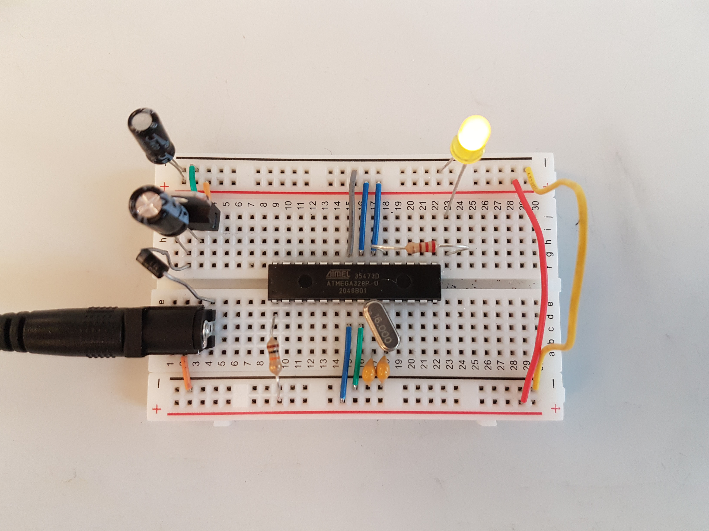
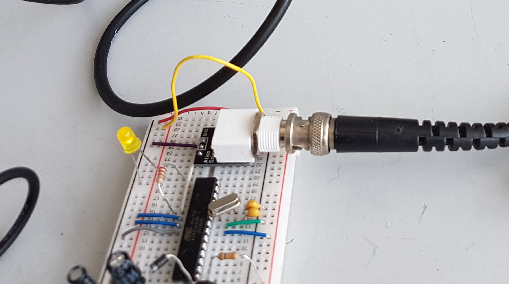

## picam_sync_neuro: Millisecond Precision Video Recording and Neurosignal Synchronization  

📝 Overview

This project enables millisecond precision synchronization of two Raspberry Pi Camera video recordings from different angles and synchronizing them with each other and neural recordings. 

Achieving this requires:

- a serial connection between two Raspberry Pis.  

- a randomly blinking LED driven by an ATMEGA328P microcontroller.  
that
- a DAQ board to record LED voltage and neural signals.  

- Custom post-processing code to synchronize the Pi Cameras with the DAQ signals.  

🚀 Features

✅ Dual Pi Camera synchronization with millisecond precision  
✅ Arduino-driven LED synchronization  
✅ DAQ board integration for neural signal alignment  
✅ Optional manual start of the recording scripts on the Raspberry Pis or automation via ansible   
✅ Robust post-processing pipeline  

🛠️ Hardware & Components

Required Hardware

2× Raspberry Pi 3B+ v1.3 (32-bit Raspbian) with [**NO-IR** Pi Camera modules](https://www.adafruit.com/product/3100) each  

1× [FTDI Serial TTL-232 USB Cable](https://www.adafruit.com/product/70) and [female RS232-to-TTL converter](https://www.amazon.com/MAX3232-Connector-Converter-Equipment-Upgrades/dp/B07PFB4MHR?keywords=RS232+to+TTL+adapter&linkCode=ll2&linkId=068289c5d86a3fea3e85f853d1c90e97&psc=1&qid=1567698272&s=gateway&spLa=ZW5jcnlwdGVkUXVhbGlmaWVyPUExTUxVTTJIUDJSTEJGJmVuY3J5cHRlZElkPUEwNTgzMzQ3M0NJRU1EUVRJMElVViZlbmNyeXB0ZWRBZElkPUEwNjQ1MTg5MUxQNFRXTVRFQ0RHTSZ3aWRnZXROYW1lPXNwX2F0ZiZhY3Rpb249Y2xpY2tSZWRpcmVjdCZkb05vdExvZ0NsaWNrPXRydWU%3D&sr=8-1-spons)

1× Arduino Board (e.g. the [Starter Kit](https://store-usa.arduino.cc/products/arduino-starter-kit-multi-language))

1x [ATMEGA328P microcontroller kit](https://www.amazon.com/ATMEGA328P-PU-Without-Ar-BOOTLOADER-Socket-Crystal/dp/B07Q3F1D9Z?crid=1RZL4OTYPLHH1&dchild=1&keywords=atmega328p-pu&qid=1619732452&sprefix=ATMega328P%25252Caps%25252C166&sr=8-13), [breadboard](https://www.adafruit.com/product/1609)

1x [940nm Infrared LED](https://www.amazon.com/Adafruit-Super-bright-5mm-pack-ADA388/dp/B00ULB0U44) invisible to humans (!) and mice + wires

1× DAQ Board (e.g., in a Fiber Photometry or Open-Ephys rig) for voltage and neural signal recording


📂 Installation & Setup

1️⃣ Software Installation

Clone the repository to both Pis and the main computer (eg. your laptop or the workstation with the DAQ board):

```
cd ~/Desktop/
git clone https://github.com/chgebhardt/picam_sync_neuro.git
```
install dependencies on your main computer:   
```
cd picam_sync_neuro 
conda env create -f python_dependencies_reqs.yml
conda activate picam_sync_neuro
```

2️⃣ Hardware Setup

- Setup raspberry Pis as rpi1 and rpi2 and connect the respective Pi Cameras.
- Connect Raspberries rpi2>rpi1 via the Serial TTL-232 connection. Otherwise, I basically followed 
[this](https://practicingelectronics.wordpress.com/2018/04/22/serial-port-for-a-raspberry-pi-using-a-usb-to-serial-adapter/).
  
- Set up an [Arduino as ISP](https://www.notesandvolts.com/2013/01/fun-with-arduino-arduino-as-isp.html) and copy the [arduino script for a blinking LED](https://github.com/chgebhardt/picam_sync_neuro/tree/main/code/arduino) on the ATMEGA328P microcontroller.

<p align="center">
  
</p>

- Configure DAQ board inputs for LED voltage recording.
  *This depends very much on what kind of neural signal recording system you have. Most rigs will have a DAQ with a BNC input, so I added a [female pre-assembeled BNC](https://atlas-scientific.com/connectors/pre-assembled-female-bnc/) into the arduino circuit on the breadboard. Connect the BNC out on the breadboard to a BNC Input on the DAQ and then it is just a matter of telling your DAQ which Input to listen to.*

<p align="center">
  
</p>

- (Optional: Solder the LED circuit and BNC permanently to a breadboard)  
  *Be careful, you wont be able to see the 940nm LED blinking unless you image the LED with the NOIR Pi Cameras. A voltmeter and/or Oscilloscope might come in handy too.*

- Finally, place the breadboard such that the LED can be imaged with both Pi Cameras. 

3️⃣ Video Recording on both Pis:

- VNC into both Pis
- run [camera_preview.py](https://github.com/chgebhardt/picam_sync_neuro/blob/main/code/raspberry_pis/camera_preview.py) from within Thonny or a python editor of choice. You should be able to see the blinking LED.
- open a terminal in each Pi
- then modify the config.yaml according your needs (has to be the same on both Pis):
  ```
  cd ~/Desktop/picam_sync_neuro/code/raspberry_pis
  nano config.yaml
  ```
- first, run main.py on rpi1 (serial msg receiver) and then on the rpi2 (serial msg sender):
  ```
  python3 main.py config.yaml 
  ```
(optional: Install a scheduler on your main computer e.g. ansible)
```
sudo apt get update
sudo apt get install ansible
```
(optional: Set up an inventory.ini file containing the IP addresses and ports to connect to your Pis on your main computer)
```
nano inventory.ini
```
(optional: Modify the config.yaml on the main computer)
```
nano config.yaml
```
(optional: Start the ansible-playbook on the main computer. This takes care of the transfer of the config.yaml to both Pis as well as script timing.)
```
cd code/host_ansible_scheduler
ansible-playbook -i inventory.ini run_pi_behavior_script.yaml --ask-become-pass -e "source_directory=/home/<username>/Desktop/picam_sync_neuro/code/raspberry_pis"
```


📊 Data Processing & Synchronization (**in progress!!!**)

- retrieve the recorded experiment folders from the Pis
  - edit connections.ini such that it contains the IP addresses and ports of the Pis, e.g.:
    ```
    cd picam_sync_neuro/code/create_project/
    nano connections.ini

    add something like this to connections.ini:  
    rpi1: 192.168.1.100:222
    rpi2: 192.168.1.101:222
    ```   
  - start fetch_exp script specifying a local data directory on the command line and follow the instructions:
    ```
    ./fetch_exp.sh "/home/<username>/Desktop/picam_sync_neuro/tests"
    ```
   
- project initiation:
  - open jupyter notebook and start project_initiation.ipynb, choose datadir (=folder to where fetch_exp transferred the experiment files from the Pis), fps (frames per second) and the experiment identifier (yyyymmdd_e#)  
    *this script converts the h264 movies to mp4 (requires ffmpeg) and extracts the intensity values of the blinking LEDs per PiCamera to csv files (needed for synchronization)*  

- open analysis_pipeline.ipynb, choose datadir and experiment identifier (yyyymmdd_e#)  
  - this script loads the PiCamera data (frame timing and extracted LED intensity values / LED blink timing from all Picameras) and saves them in a dictionary picam_dict
  - loading the DAQ timing data might be different depending on the way you can access that data from the DAQ:  
    *Remember you are recording the LED voltage (a binary signal, either high or low) on a DAQ Input. Very often the DAQ just discretely records signal changes from high to low or vice versa. In this case we need to generate a "continuous" signal from this discrete data first at a defined sampling frequency. If the DAQ already records a "continous" voltage signal we can skip this step.)* 

📜 License

- **Code** is licensed under the [MIT License](LICENSE).
- **Documentation, images, and non-code materials** are licensed under [Creative Commons Attribution 4.0 (CC-BY 4.0)](LICENSE-docs).

🤝 Contributing

Pull requests and feature suggestions are welcome! See CONTRIBUTING.md for guidelines.

🔗 References & Acknowledgments

This project was inspired by various open-source tutorials and resources. See ACKNOWLEDGMENTS.md for full credits.
